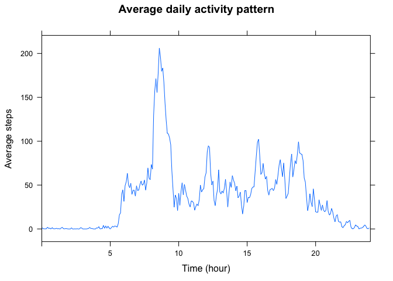
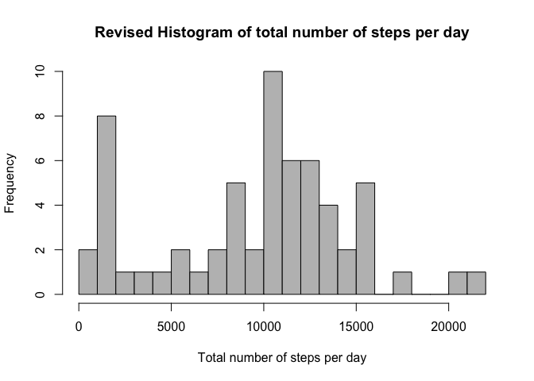
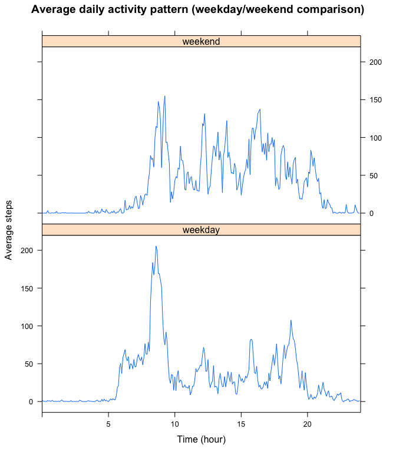

# Reproducible Research: Peer Assessment 1

This report is a submission to **Peer Assessment 1** in the **Reproducible Research** course on Coursera which is part of the *Data Science* Specialization.

## Loading and preprocessing the data

### 1. Load the data
First we load the data using `read.csv()`

Note that the data is zipped in the file `activity.zip`, so we call the `unz()`function to unzip and extract the csv file `activity.csv` within the zip file. The result is a data frame with 3 variables.

We use the `colClasses` parameter to set the classes for each column in the data frame.


```r
data <- read.csv(unz("activity.zip", "activity.csv"),
                 colClasses = c("integer", "character", "factor"))
str(data)
```

```
## 'data.frame':	17568 obs. of  3 variables:
##  $ steps   : int  NA NA NA NA NA NA NA NA NA NA ...
##  $ date    : chr  "2012-10-01" "2012-10-01" "2012-10-01" "2012-10-01" ...
##  $ interval: Factor w/ 288 levels "0","10","100",..: 1 226 2 73 136 195 198 209 212 223 ...
```

### 2. Process/transform the data

The second column `date` should really be of class `Date` so we convert it using the `as.Date()` function.


```r
data$date_asDate <- as.Date(data$date, "%Y-%m-%d")
str(data)
```

```
## 'data.frame':	17568 obs. of  4 variables:
##  $ steps      : int  NA NA NA NA NA NA NA NA NA NA ...
##  $ date       : chr  "2012-10-01" "2012-10-01" "2012-10-01" "2012-10-01" ...
##  $ interval   : Factor w/ 288 levels "0","10","100",..: 1 226 2 73 136 195 198 209 212 223 ...
##  $ date_asDate: Date, format: "2012-10-01" "2012-10-01" ...
```


## What is mean total number of steps taken per day?

### 1. Calculate the total number of steps taken per day

We calculate the steps per day by splitting the data frame by date, and then using the `sapply()` function to sum the total number of steps for each date. Note that NA values are ignored.


```r
s <- split(data, as.factor(data$date))
steps_per_day <- sapply(s, function(d) sum(d$steps, na.rm = TRUE))
```

### 2. Histogram of the total number of steps taken each day

For simplicity we use the base plotting system to plot a simple histogram of `steps_per_day`. with breaks corresponding to every 1000 steps.


```r
hist(steps_per_day,
     breaks = range(steps_per_day)[2] %/% 1000,
     main = "Histogram of total number of steps per day",
     xlab = "Total number of steps per day", col = "gray")
```

 

### 3. Mean and Median of the total number of steps taken per day

Mean and Median can be calculated using R functions. The results are displayed by rounding to the nearest whole number.


```r
sprintf("Mean steps per day : %.0f steps", mean(steps_per_day))
```

```
## [1] "Mean steps per day : 9354 steps"
```

```r
sprintf("Median steps per day : %.0f steps", median(steps_per_day))
```

```
## [1] "Median steps per day : 10395 steps"
```

## What is the average daily activity pattern?

### 1. Average number of steps taken for each 5 minute interval (averaged across all days)

This is expressed as a time series `myts`


```r
intervals <- split(data, data$interval)
avg_steps_per_interval <- sapply(intervals, function(i) mean(i$steps, na.rm = TRUE))
myts <- ts(avg_steps_per_interval, start = 0, deltat = 1/12)
```

### 2. Time series plot


```r
plot(myts,
     type = "l",
     main = "Average daily activity pattern",
     xlab = "Time (hour)",
     ylab = "Average steps")
```

 

### 3. 5 minute interval that contains the maximum number of steps

This can be derived by sorting `avg_steps_per_interval` by decreasing order, then inspecting the name of the first element of the vector.

This is interval 0835 (ie. 8:35AM) which has an average of 206 steps.


```r
sort(avg_steps_per_interval, decreasing= TRUE)[1]
```

```
##      835 
## 206.1698
```

## Imputing missing values

### 1. Total number of missing values in dataset

This can be computed by counting number of rows in the data with `steps` equal `NA`


```r
sum(is.na(data$steps))
```

```
## [1] 2304
```

### 2. Strategy for filling in missing values

There are 4 suggested strategies for filling in missing values:

1. mean for that day
2. mean for that 5-minute interval
3. median for that day
4. median for that 5-minute interval

The 4th strategy is selected. We first build a vector `median_steps` containing the median steps for each interval


```r
median_steps <- sapply(intervals, function(i) median(i$steps, na.rm = TRUE))
```

### 3. New dataset with missing data filled in

We create a new dataset called `filled_data` and create an extra column called `median_steps` containing the appropriate mean for that interval, then we replace all `NA` values with the mean 


```r
filled_data <- data
filled_data$median_steps <- median_steps[as.character(data$interval)]
filled_data[is.na(data$steps),"steps"] <- filled_data[is.na(data$steps),"median_steps"]
```


### 4. Revised Histogram of the total number of steps taken each day

We calculate a revised `filled_steps_per_day` using `filled_data` and then plot the revised histogram.


```r
filled_s <- split(filled_data, as.factor(filled_data$date))
filled_steps_per_day <- sapply(filled_s, function(d) sum(d$steps, na.rm = TRUE))
hist(filled_steps_per_day,
     breaks = range(filled_steps_per_day)[2] %/% 1000,
     main = "Histogram of total number of steps per day",
     xlab = "Total number of steps per day", col = "gray")
```

 

### 5. Revised Mean and Median of the total number of steps taken per day

The revised Mean and Median are calculated using `filled_steps_per_day`.


```r
sprintf("Mean steps per day : %.0f steps", mean(filled_steps_per_day))
```

```
## [1] "Mean steps per day : 9504 steps"
```

```r
sprintf("Median steps per day : %.0f steps", median(filled_steps_per_day))
```

```
## [1] "Median steps per day : 10395 steps"
```

Note that the mean steps per day has increased due to the filling in of data, but the median has not. This is expected, as our strategy for filling in missing data was to use the median steps for the interval.

## Are there differences in activity patterns between weekdays and weekends?

### 1. New factor variable in the dataset to represent "weekday" and "weekend" 

We create a new column called `day_type` in `data` which is a factor to represent whether the date is a weekday or weekend.


```r
day_type = c(Sunday = "weekend",
             Monday = "weekday",
             Tueday = "weekday",
             Wednesday = "weekday",
             Thursday = "weekday",
             Friday = "weekday",
             Saturday = "weekend")
data$day_type <- as.factor(day_type[as.character(weekdays(data$date_asDate))])
```

### 2. Panel plot

We generate two time series - one for weekdays and one for weekends


```r
data_weekday <- data[data$day_type == "weekday",]
weekday_ts <- ts(sapply(split(data_weekday, data_weekday$interval),
                        function(i) mean(i$steps, na.rm = TRUE)),
                 start = 0,
                 deltat = 1/12)
data_weekend <- data[data$day_type == "weekend",]
weekend_ts <- ts(sapply(split(data_weekend, data_weekend$interval),
                        function(i) mean(i$steps, na.rm = TRUE)),
                 start = 0,
                 deltat = 1/12)
```

We then plot the two time series


```r
par(mfrow = c(2, 1), mar = c(5, 4, 2, 1))
plot(weekday_ts,
     type = "l",
     ylim = c(0,300),
     main = "Average daily activity pattern (Weekdays)",
     xlab = "Time (hour)",
     ylab = "Average steps")
plot(weekend_ts,
     type = "l",
     ylim = c(0,300),
     main = "Average daily activity pattern (Weekends)",
     xlab = "Time (hour)",
     ylab = "Average steps")
```

 

From the above two plots, it would seem the daily activity patterns tends to be

1. Lower on weekdays compared to weekends for intervals ranging from 00:00 to 15:00
2. Higher on weekdays for intervals ranging from 20:00 to 24:00

Assuming that the interval values are skewed by timezone (the period 15:00 to 20:00 represents sleep), a potential hypothesis for the difference is that the individual is more active during the day for weekdays, but more active in the evenings for weekends.
